# MediConnect+

## About

- App desarrollada con JavaScript, NodeJs, Express, PostgreSQL, Sequelize, React, Redux y Material UI.

## Funcionalidades: 
- Login
- Agregar Paciente/Profesional
- Hablar mediante Chat integrado.
- Realizar Videollamada.
- Registrar Turnos.
- Solicitar/Emitir Recetas.
- Solicitar/Emitir Ordenes Medicas.

__Pagina inicial__: 

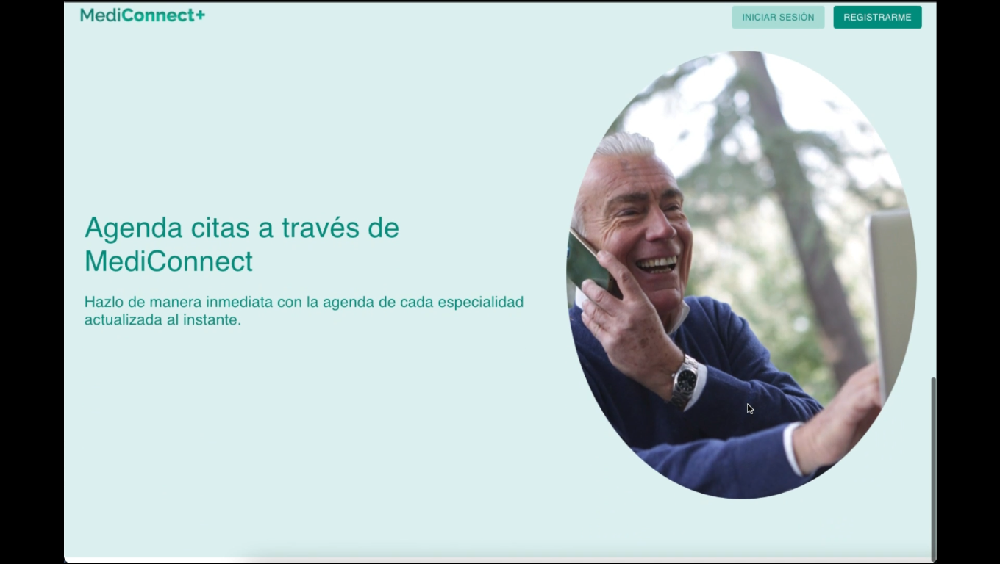

__Formulario Profesional__:

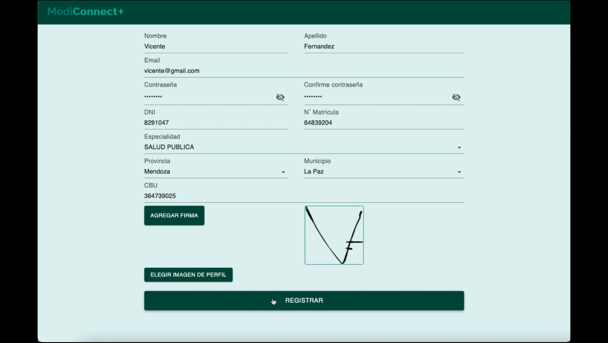

__Login__: 

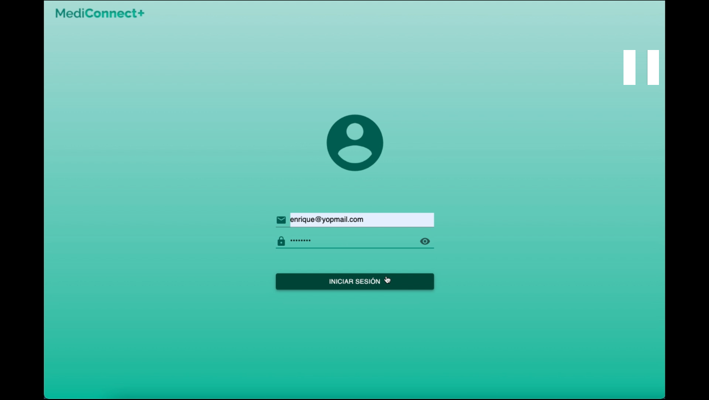

__Ruta principal__: 

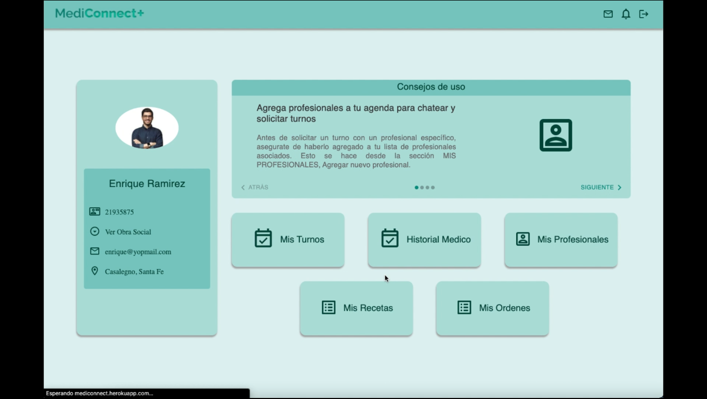

__Contactos__:

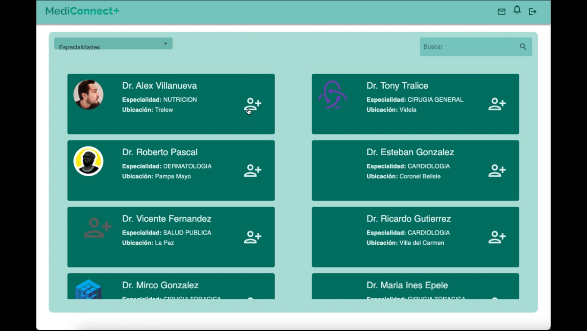
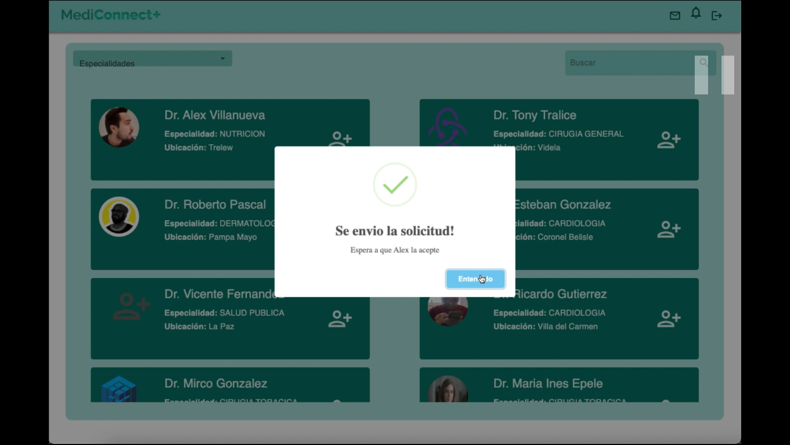

__Chat__:

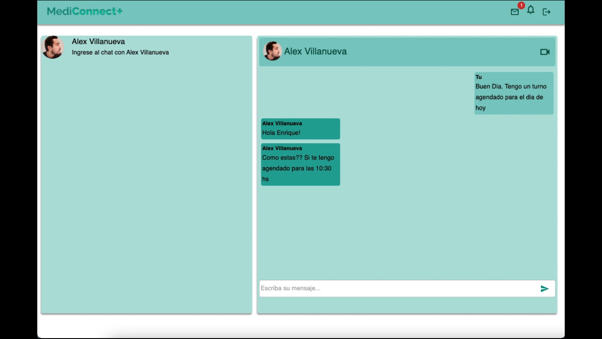

__Videollamada__:

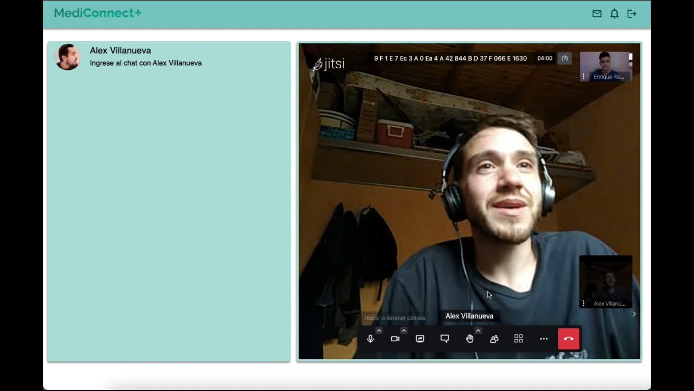

__Recetas medicas__:

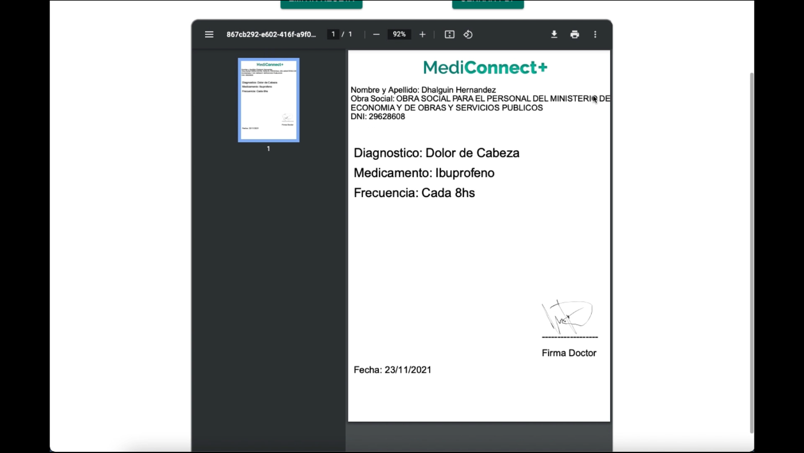
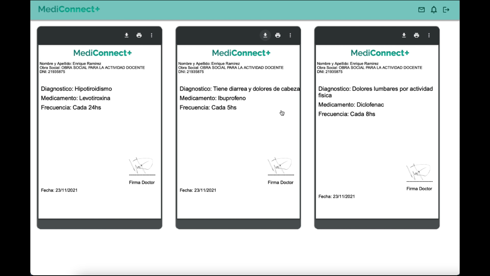

__Registro de enfermedades__:

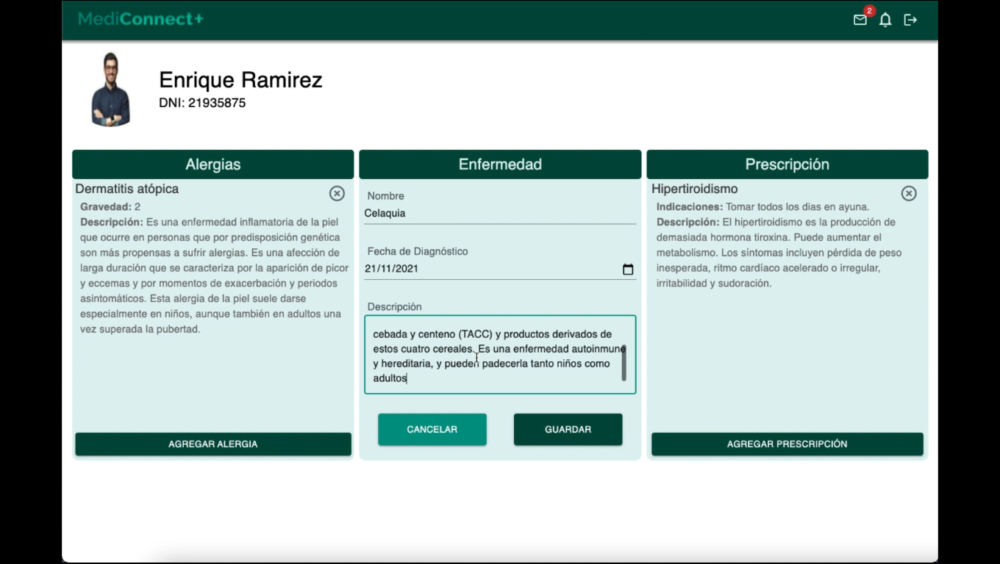

__Coordinar Turno__:

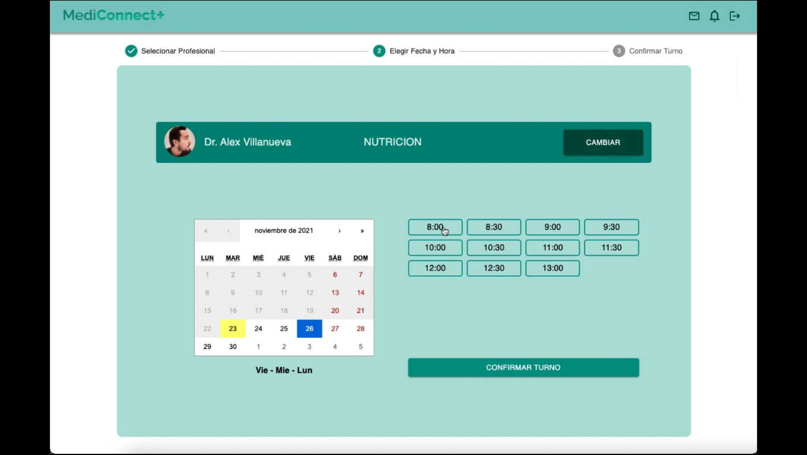

